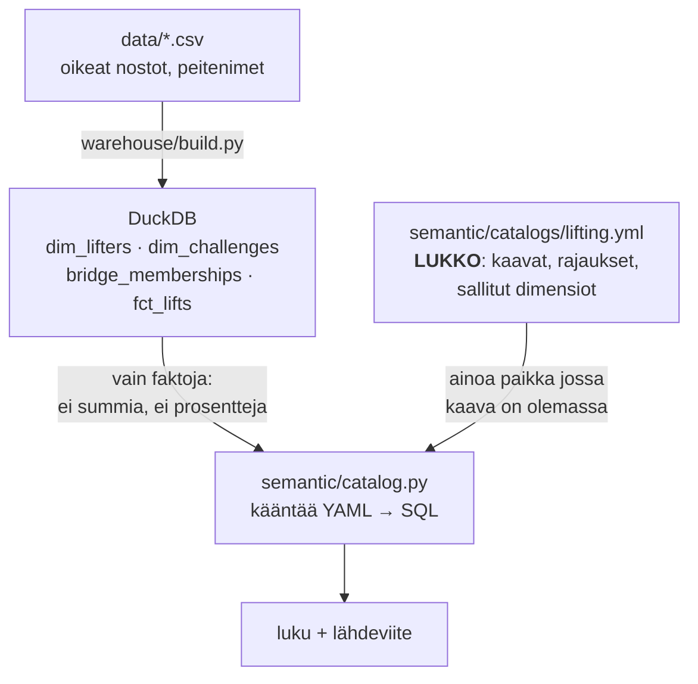
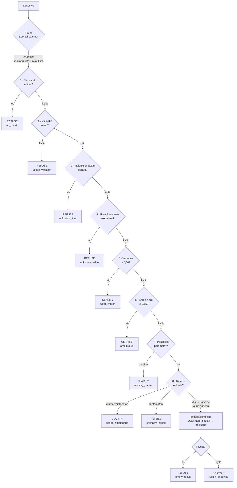

# Miten tämä toimii

Kaksi kuvaa: mistä luku tulee, ja miten kysymyksestä päätetään. Ne ovat eri
asioita, ja niiden sekoittaminen on se, mikä tekee tavallisesta
"tekoäly + tietokanta" -demosta arvaamattoman.

---

## 1. Mistä luku tulee



Kaksi asiaa kuvassa ovat koko rakenteen ydin:

**Varastossa ei ole yhtään laskettua mittaria.** Ei prosentteja, ei summia —
vain rivejä (kuka, päivä, kilot, toistot). Syy: tallennettu prosentti lukittuu
yhteen rakeisuustasoon eikä sitä voi laskea uudelleen ylemmällä. `AVG(rivien %)`
ei ole `SUM(a)/SUM(b)`. Sama sääntö kuin Power Pivotissa mittarin ja lasketun
sarakkeen välillä.

**Kääntäjä on ainoa paikka, joka tuottaa SQL:ää.** Ei kutsupolkua, joka ohittaa
sen. Poista `lifting.yml` ja jokainen kysely kaatuu — `tests/test_catalog_is_lock.py`
todistaa sen.

---

## 2. Miten kysymyksestä päätetään

Kielimalli **ehdottaa**. Portit **päättävät**. Porteissa ei ole kielimallia:
ne ovat if-lauseita, eikä niitä voi puhua ympäri.



### Miksi portit ovat juuri tässä järjestyksessä

**Faktat ennen arvioita.** Portit 3–4 (onko tämä henkilö olemassa?) ajetaan
ennen portteja 5–6 (onko kysymys selvä?). Olemassaolo on fakta datasta; varmuus
on arvio kysymyksestä.

Tämä oli aluksi väärin päin, ja täsmäytys paljasti sen: *"Miten Matilla menee?"*
— epämääräinen **ja** olemattomasta henkilöstä — vastasi *"tarkenna"*. Se
kehottaa muotoilemaan uudelleen kysymyksen, johon ei voi koskaan vastata.

### Portit taulukkona

| # | Portti | Ehto | Tulos |
|---|---|---|---|
| 1 | Ei osumaa | 0 tunnistettua mittaria | **REFUSE** + lista osatuista |
| 2 | Rajan ylitys | kysymys pyytää yli haasterajojen | **REFUSE** |
| 3 | Tuntematon rajaus | avain ei mittarin sallitussa listassa | **REFUSE** |
| 4 | Olematon arvo | nimeä ei ole datassa | **REFUSE** — ei nollaa, ei tyhjää |
| 5 | Heikko osuma | paras < 0,60 | **CLARIFY** |
| 6 | Tasapeli | paras − toinen < 0,15 | **CLARIFY** |
| 7 | Puuttuva parametri | esim. aikaikkuna | **CLARIFY** |
| 8 | Rajaus | 1 → ratkaise ja lue ääneen · monta → **CLARIFY** · 0 → **REFUSE** |
| — | Tyhjä tulos | kysely ei osunut yhteenkään riviin | **REFUSE** |

Portti 4 ansaitsee oman huomionsa. Jos kysyt henkilöstä, jota ei ole, tyhmä
järjestelmä palauttaa `0 kg` tai tyhjän taulukon. **Molemmat näyttävät
luvulta**, eikä lukija voi erottaa niitä oikeasta. Siksi ne kieltäydytään
erikseen ja sanotaan ääneen miksi.

Viimeinen rivi on sama asia toisessa kohdassa: oikea henkilö, joka ei kuulu
tähän haasteeseen, tuottaa tyhjän tuloksen. Ilman tätä porttia se tulostuisi
täydellisen lähdeviitteen alla, ja lukija päättelisi arvon olevan nolla.

---

## 3. Kokeile itse

```bash
python -m nlq.cli          # interaktiivinen istunto, ei argumentteja
```

`:help` listaa komennot ja muutaman kysymyksen, jotka osuvat eri portteihin.
`:router rules` vaihtaa avaimettomaan versioon kesken istunnon, jolloin saman
kysymyksen voi kysyä molemmilla peräkkäin. `:show <mittari>` näyttää
määritelmän ennen kuin luottaa lukuun.

---

## 4. Miltä kolme lopputulosta näyttävät

**Vastaus** — huomaa rajaus ensimmäisellä rivillä ja jako kahteen varmuusasteeseen:

```
$ python -m nlq.cli "Paljonko porukan yhteistulos on nyt?"

Rajaus: Kalterikarnevaalit 2026  (ainoa datassa -- ratkaistu automaattisesti)

                                          538.3 kg

    josta oikeaa ykkosmaksimia            140.0 kg   26 %
         laskennallista                   398.3 kg   74 %

- Lahde ----------------------------------------------------------
  Mittari       crew_total_1rm_kg
  Maaritelma    SUM(one_rm_kg)
  Rakeisuus     challenge
  Rajaukset     challenge = C1
  Jasenia       4  (datassa 5 kayttajaa; 1 ei kuulu tahan haasteeseen, ei mukana)
  Katalogi      semantic/catalogs/lifting.yml:128
```

**Tarkennuspyyntö** — portti 6, kaksi yhtä uskottavaa lukemaa:

```
$ python -m nlq.cli --router rules "Mika on tavoite?"

Tarvitsen tarkennuksen: Kysymys osuu useaan mittariin yhta hyvin.
En valitse puolestasi.

  1  crew_goal_kg                   Haasteen tavoite
  2  crew_member_target_sum_kg      Jasenten omien tavoitteiden summa
```

**Kieltäytyminen** — portti 4 ja tyhjän tuloksen portti yhdessä esimerkissä:

```
$ python -m nlq.cli --router rules "Mika on Kallen nykyinen ykkosmaksimi?"

En vastaa: rajaus Kalterikarnevaalit 2026 ei sisalla yhtaan rivia
mittarille lifter_current_1rm_kg.
"Kalle Ehdonalainen" on datassa, mutta ei kuulu haasteeseen
Kalterikarnevaalit 2026.
En palauta nollaa enka tyhjaa taulukkoa -- molemmat nayttaisivat luvulta.
```

---

## 5. Missä mikäkin vaihe elää

| Vaihe | Tiedosto | Riviä |
|---|---|---|
| Lataus CSV → DuckDB | `warehouse/build.py`, `warehouse/schema.sql` | ~180 |
| **Lukko: mittarien määrittelyt** | `semantic/catalogs/lifting.yml` | 275 |
| Katalogin lataus, validointi, SQL-käännös | `semantic/catalog.py` | ~330 |
| Mallin valinta ja kuljetus | `nlq/providers.py`, `nlq/router_llm.py` | ~330 |
| Avaimeton varareitti | `nlq/router_rules.py` | ~140 |
| **Portit** | `nlq/gates.py` | ~250 |
| Vastaus ja lähdeviite | `nlq/answer.py` | ~220 |
| Interaktiivinen istunto | `nlq/repl.py` | ~150 |
| Täsmäytys | `evals/questions.yml`, `evals/run_evals.py` | ~140 + 240 |

Huomaa suhde: **katalogi ja portit ovat repon sisältö.** Kielimallia koskeva
koodi on kuljetuskerros, ja se on tarkoituksella vaihdettavissa —
[AGENTIN-MUOTO.md](AGENTIN-MUOTO.md).

---

## 6. Mitä tämä ketju takaa — ja mitä ei

**Takaa:** ulos tuleva luku on määritelty mittari, oikein laskettuna,
täydellisellä lähdeviitteellä ja pakollisella rajauksella. Selvästi
monitulkintainen kysymys johtaa kysymykseen eikä arvaukseen.

**Ei takaa:** että valittu mittari on se, jota tarkoitit. Portit eivät näe
aikomusta. Jos router palauttaa yhden ehdokkaan suurella varmuudella,
tasapeliportti ei laukea — vaikka ehdokas olisi väärä.

Se, mikä suojaa lukijaa siinä kohdassa, ei ole portti vaan **lähdeviite**.
Ero perinteiseen text-to-SQL:ään ei ole *"tämä ei voi olla väärässä"* vaan
**"kun tämä on väärässä, sen näkee"**.

Koko rehellinen lista rajoista: [MISSA-TAMA-HAJOAA.md](MISSA-TAMA-HAJOAA.md).
